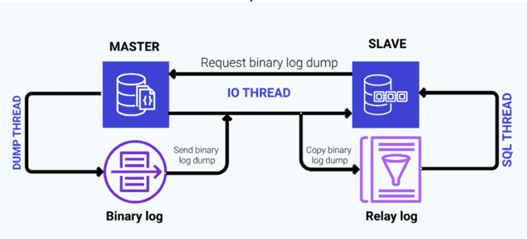
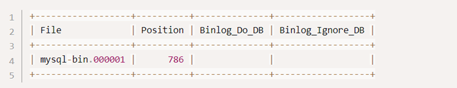
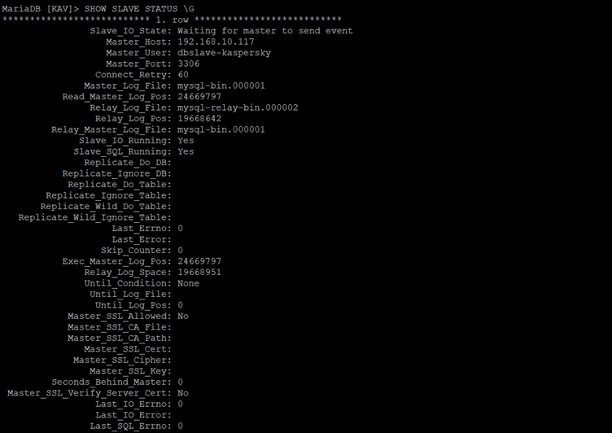
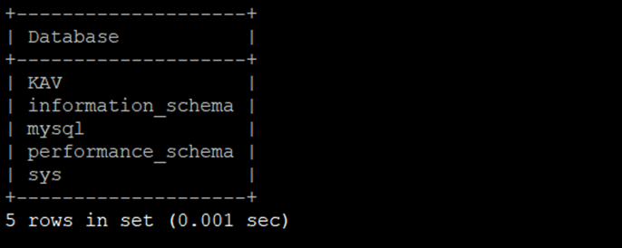
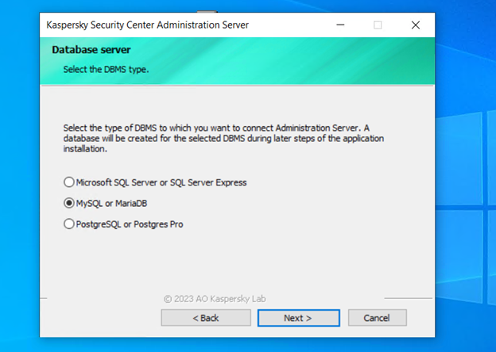
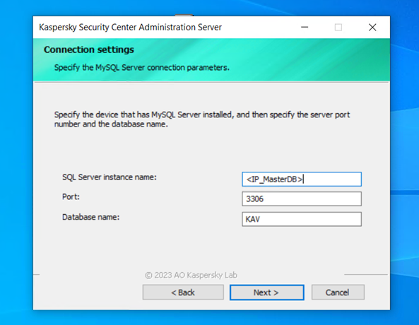
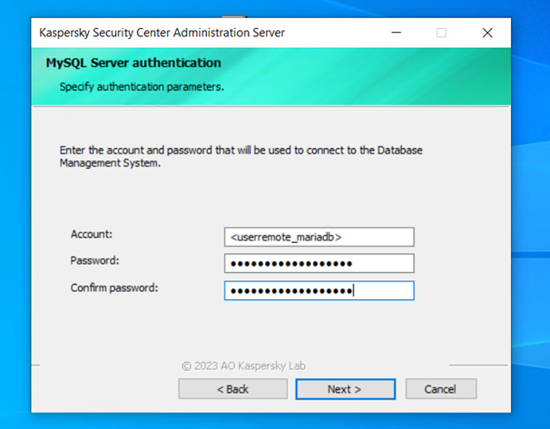
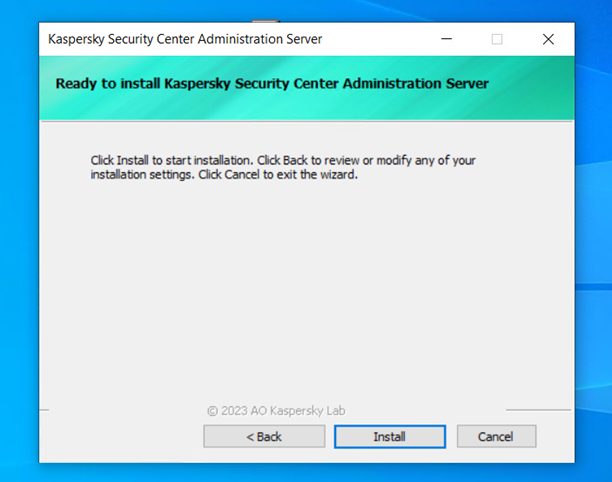
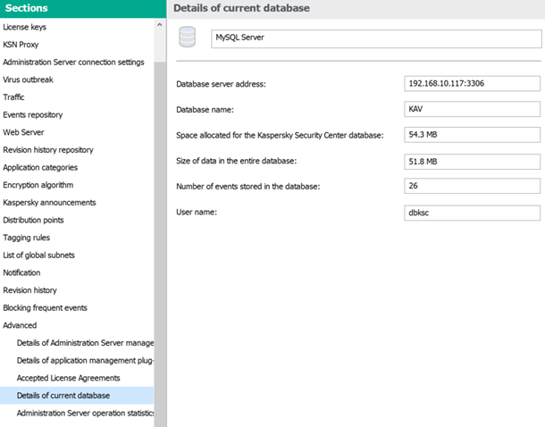

> Database replication is the process of creating and maintaining multiple copies of a database in order to ensure data availability, fault tolerance, and scalability. Replication involves synchronizing data between the original or primary database and one or more secondary databases, known as replicas


### Step 1 – Install MariaDB on All Nodes [ Master / Slave ] ###
First, need to install MariaDB server package on both master and slave 
```
apt-get install mariadb-server -y
```
After installing the MariaDB server, start the MariaDB server service and enable it to start after system reboot:
```
systemctl start mariadb
systemctl enable mariadb
```
Next, you will need to secure the MariaDB installation and set a MariaDB root password. You can do it by running the mysql_secure_installation script:
```
mysql_secure_installation
```
Answer all the questions as shown below:
```
Enter current password for root (enter for none): Enter
Set root password? [Y/n] Y
Remove anonymous users? [Y/n] Y
Disallow root login remotely? [Y/n] Y
Remove test database and access to it? [Y/n] Y
Reload privilege tables now? [Y/n] Y
```
Once you are finished, you can proceed to configure the Master node.

### Step 2 – Setting Configuration on Master Node ###
MariaDB server uses a binary log file to perform the replication. By default, the binary log is disabled in the MariaDB default configuration. So you will need to edit the MariaDB configuration file and enable the binary log.
```
nano /etc/mysql/mariadb.conf.d/50-server.cnf
```
First, change the bind-address from localhost to 0.0.0.0:
```
bind-address            = 0.0.0.0
```
Next, add the following lines at the end of the file to enable the binary log:
```
server-id              = 1
log_bin                = /var/log/mysql/mysql-bin.log
max_binlog_size        = 100M
relay_log = /var/log/mysql/mysql-relay-bin
relay_log_index = /var/log/mysql/mysql-relay-bin.index
```
Save and close the file when you are finished then restart the MariaDB service to apply the changes:
```
systemctl restart mariadb
```
this point, MariaDB is configured and listens on port 3306. You can check it with the following command:
```
netstat -tulnp 
```
You should get the following output:


### Step 3 – Create replicate user on Master node ###
Next, you will need to create a replication user on the Master node. The Slave node will use this user to connect to the Master server and request binary logs.
To create a replication user, connect to the MariaDB with the following command:
```
mysql -u root -p
```
Next, create a replication user and set a password:
```
>CREATE USER '<username_replicate>'@'%' identified by '<password_replicate>';
```
Next, grant replication slave privilege to the user with the following command:
```
> GRANT REPLICATION SLAVE ON *.* TO '<username_replicate>'@'%';
```
Next, flush the privileges to apply the changes:
```
>FLUSH PRIVILEGES;
```
Next, verify the Master status using the following command:
```
> SHOW MASTER STATUS;
```
You should get the binary log file name and position in the following output:

Note: Please remember File and Position value from the above output. You will need this value on the Slave server.

### STEP 4 – Setting Configuration Slave Node  ###
Next, you will need to enable the relay log and replication on the Slave node. You can do it by editing the MariaDB main configuration file:
```
nano /etc/mysql/mariadb.conf.d/50-server.cnf
```
First, change the bind-address from localhost to 0.0.0.0:
```
bind-address            = 0.0.0.0
Next, add the following lines at the end of the file to enable relay log and replication:
server-id              = 2
log_bin                = /var/log/mysql/mysql-bin.log
max_binlog_size        = 100M
relay_log = /var/log/mysql/mysql-relay-bin
relay_log_index = /var/log/mysql/mysql-relay-bin.index
```
Save and close the file then restart the MariaDB service to apply the changes:
```
systemctl restart mariadb
```
Next, you will need to set up the Slave node to replicate the Master node.
First, connect to the MariaDB with the following command:
```
mysql -u root -p
```
Once you are connected, stop the Slave with the following command:
```
> STOP SLAVE;
```
Next, set up the slave to replicate the master with the following command:
```
> CHANGE MASTER TO MASTER_HOST = '<IP_MasterDB>', MASTER_USER = '<username_replicate>', MASTER_PASSWORD = '<password_replicate>', MASTER_LOG_FILE = '<binarylog-filename>', MASTER_LOG_POS = <binarylog-fileposition>;
```
> IP_MasterDB                 =  the IP address of the Master node.
> username_replication    =  the replication user.
> password_replication     =  the replication user password.
> binarylog-filename         =  the binary log file name.
> binarylog-fileposition      =  is the binary log file position.

Next, start the Slave with the following command:
```
> START SLAVE;
```

### STEP 5 – Verify MariaDB Replication ###
At this point, MariaDB Master and Slave node is configured. Now, you will need to test whether the replication is working or not.
First, go to the Master node and connect to the MariaDB console:
```
mysql -u root -p
```
Once you are connected, check the Slave status with the following command:
```
> SHOW SLAVE STATUS \G
```
If everything is fine, you should get the following output:

Now, list all databases using the following command:
```
> SHOW DATABASES;
```
You can see database is replicated from the Master node:


### Step 6 – Create user database MariaDB Master for KSC remote ###
Need to create a new user Kaspersky Security Center to remote the database MariaDB server, locate IP KSC to specific where the user connect
```
> CREATE USER '<userRemote_mariadb>'@'<IP_Remote>' IDENTIFIED BY '<password_userRemote>';
```
Give all privileges to the user remote, to easy KSC access and write the database on MariaDB server
```
> GRANT ALL PRIVILEGES ON *.* TO 'userRemote'@'IP_Remote';
```
Tell the server to reload the grant tables
```
> FLUSH PRIVILEGES;
```

### Step 7 – Connect KSC to MariaDB Master ###
On select the DBMS type during installation install Kaspersky Security Center, pick the DBMS is MySQL or MariaDB

On form, In instance name put the IP Address MariaDB server 
 
For the authentication, write the user account 'userRemote_mariadb' and password “password_userRemote” that we create later 
 
After that, click Install to install Kaspersky Security Center on the machine 


### Step 8 – Check Detail Database on KSC ###



